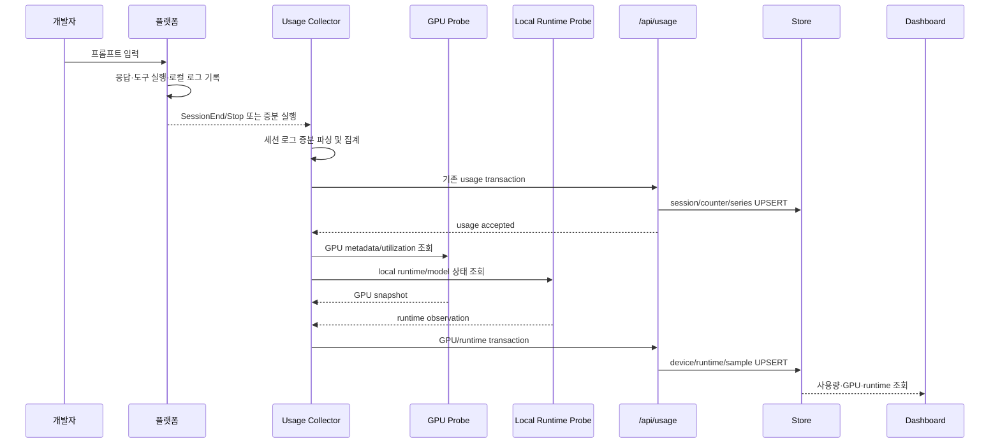

# 기획 — 프롬프트 트랜잭션 이후 GPU·로컬 LLM 실행 수집

## 1. 목적

개발자가 프롬프트를 입력한 뒤 기존 사용량 트랜잭션이 완료되면, 같은 수집 실행에서 개발자
머신의 GPU 정보, 로컬 LLM runtime, 모델 분류, 트랜잭션 직후 GPU snapshot을 수집한다.

클라우드 API 호출이 개발자 머신의 GPU를 사용했다고 추정하지 않는다. 실제로 관측된 로컬 장비,
로컬 프로세스, 로컬 endpoint에 대해서만 수집한다.

## 2. 원칙

- 기존 `POST /api/usage` 계약과 대시보드를 유지한다.
- GPU 정보는 세션 row에 반복 저장하지 않고 machine/runtime 데이터로 분리한다.
- 모델명만으로 GPU 사용 여부를 추론하지 않는다.
- `runtime=local` 또는 실제 로컬 endpoint가 확인된 경우에만 로컬 LLM으로 판정한다.
- GPU probe 실패가 기존 사용량 보고를 실패시키면 안 된다.
- 프롬프트 원문, tool args, 파일 경로, 환경변수, API token, PID, command line 전체는 전송하지 않는다.

## 3. 목표 트랜잭션



## 4. 첫 번째 트랜잭션 이후 순서

```text
T0 프롬프트 입력 및 플랫폼 로그 생성
T1 기존 수집기가 세션 로그를 읽음
T2 기존 사용량 payload 생성
T3 POST /api/usage 성공 확인
T4 GPU probe 실행
T5 local runtime probe 실행
T6 결과 정규화 및 개인정보 제거
T7 GPU/runtime payload 전송
T8 GPU/runtime checkpoint 저장
T9 대시보드에서 세션과 GPU 정보를 correlation으로 연결
```

T4~T8이 실패해도 T1~T3 사용량 데이터는 성공으로 유지한다. GPU 데이터는 다음 실행에서
재시도할 수 있어야 한다.

## 5. 데이터 모델

### GPU 장비 정보

```text
machine_id
username
machine_name_hash
os
arch
gpu_vendor
gpu_model
gpu_memory_total_bytes
driver_version
cuda_version
rocm_version
probe_source
observed_at
```

수집하지 않는 값: GPU serial number, PCI bus exact address, hostname 원문, 홈 경로, 환경변수 전체.

### Local LLM runtime 관측

```text
machine_id
runtime_name
runtime_kind
endpoint_class
model_name
process_class
is_local
observed_at
source
```

### GPU 사용량 snapshot

```text
machine_id
runtime_observation_id
collection_run_id
gpu_index
gpu_utilization_percent
memory_used_bytes
memory_total_bytes
temperature_c
power_watts
sample_started_at
sample_ended_at
```

모르는 값은 0으로 채우지 않고 null 또는 미수집으로 표현한다.

## 6. GPU probe 설계

### Phase 1 — 장비 정보

수집 실행 직후 한 번 조회한다.

```text
Linux NVIDIA → nvidia-smi 또는 NVML
Linux AMD    → ROCm 계열 명령/API
Windows      → 지원 가능한 vendor probe
macOS        → 시스템 GPU 정보 probe
지원 불가    → GPU 미수집
```

OS 명령을 코드 곳곳에서 직접 호출하지 않고 다음 인터페이스로 추상화한다.

```go
type GPUProbe interface {
    Snapshot(ctx context.Context) (GPUSnapshot, error)
}
```

command timeout, output size 제한, 권한 오류를 처리한다. probe 실패는 수집기 전체 실패가
아니라 GPU 미수집으로 처리한다.

### Phase 2 — 사용량 snapshot

기존 usage 전송 성공 직후 GPU 상태를 조회한다.

```text
usage accepted
  → 1~3초 안정화 대기
  → GPU utilization/VRAM 조회
  → runtime observation과 연결
  → GPU sample 전송
```

단일 snapshot은 “트랜잭션 직후 관측값”이다. 프롬프트 전체가 GPU를 사용했다는 증거로
표시하지 않는다.

### Phase 3 — 시간 구간 수집

실제 사용률 추이가 필요할 때만 별도 worker를 추가한다.

```text
local runtime 감지 → 30초 ticker → GPU snapshot → local spool append
→ runtime 종료 또는 idle timeout → 평균/최대값 계산 → 서버 전송
```

이 worker는 hook을 지연시키거나 플랫폼 종료를 막아서는 안 된다.

## 7. Local LLM runtime 감지

감지 우선순위:

1. 기존 session의 `runtime=local`
2. endpoint classifier
3. 공식 runtime metadata/API
4. 제한적인 프로세스 관찰

1차 지원 후보는 Ollama, LM Studio, llama.cpp server, vLLM, local OpenAI-compatible server다.

프로세스는 `ollama_server`, `lmstudio_server`, `vllm_server`, `llamacpp_server`,
`unknown_local_runtime` 같은 분류값만 남긴다.

원격 GPU 서버는 개발자 머신 GPU가 아니다. 원격 endpoint 호출만으로 로컬 GPU 사용으로
판정하지 않는다. 원격 서버에 collector를 설치하거나 runtime telemetry가 있어야 한다.

## 8. API 및 저장소 확장

GPU 필드를 기존 세션 row에 반복 추가하지 않고 별도 endpoint를 우선 검토한다.

```text
POST /api/usage          기존 세션 사용량
POST /api/runtime        local runtime + GPU observation
```

외부 endpoint를 하나로 유지해야 한다면 payload 내부에 별도 `runtimeObservations` 객체를 둔다.

```json
{
  "sessions": [],
  "runtimeObservations": [{
    "machineId": "opaque-id",
    "runtimeKind": "local_http",
    "modelName": "llama3.3",
    "isLocal": true,
    "gpu": [{
      "vendor": "nvidia",
      "model": "RTX 4090",
      "memoryTotalBytes": 25769803776,
      "utilizationPercent": 72
    }]
  }]
}
```

저장 대상은 `usage_sessions`, `usage_counters`, `usage_series`, `runtime_observations`,
`gpu_devices`, `gpu_usage_samples`로 분리한다. 중복 방지 키는
`collection_run_id + machine_id + sample_started_at + gpu_index`를 사용한다.

## 9. 구현 웨이브

### W0 — 기준선

- [ ] `git status`, 기존 runtime 구현, 현재 테스트 확인
- [ ] OS별 GPU probe 가능 여부 확인
- [ ] 기존 사용자 변경과 충돌하지 않는지 확인

### W1 — GPU metadata

- [ ] `collector/internal/gpu` 패키지 추가
- [ ] vendor별 probe adapter 작성
- [ ] timeout·output size 제한
- [ ] GPU metadata payload와 서버 migration 추가
- [ ] GPU 없는 머신 테스트

### W2 — 첫 트랜잭션 직후 snapshot

- [ ] 기존 usage POST 성공 이후에만 GPU probe 실행
- [ ] runtime observation과 session/correlation 연결
- [ ] GPU probe 실패 시 usage 성공 유지
- [ ] GPU payload 재시도 checkpoint 추가
- [ ] 중복 snapshot UPSERT 테스트

### W3 — 로컬 LLM 연결

- [ ] Ollama 우선 지원
- [ ] LM Studio 또는 local OpenAI-compatible endpoint 추가
- [ ] 모델명·runtime kind·locality allowlist 처리
- [ ] 원격 endpoint와 로컬 GPU 구분
- [ ] 실제 로컬 LLM 실행 fixture 추가

### W4 — 모니터링 루프

- [ ] 필요성 확정 후 ticker worker 추가
- [ ] idle timeout·최대 실행시간·spool rotation 구현
- [ ] 평균/최대 GPU 사용량 계산
- [ ] 종료 시 graceful flush

### W5 — 화면

- [ ] 머신별 GPU inventory
- [ ] 로컬 LLM runtime 목록
- [ ] 세션 직후 GPU snapshot
- [ ] 시간별 GPU utilization
- [ ] 관측 snapshot과 추정값을 명확히 구분

## 10. 검증 시나리오

### 정상

```text
로컬 LLM 프롬프트 입력 → usage 저장 성공 → GPU metadata 조회
→ runtime observation 저장 → GPU snapshot 저장 → 화면에서 연결 확인
```

### GPU 없음 또는 클라우드 사용

```text
클라우드 LLM 사용 → usage 저장 성공 → GPU probe 결과 없음 → usage만 정상 표시
```

### GPU probe 실패

```text
usage 저장 성공 → nvidia-smi timeout/권한 실패 → GPU 미수집 → 다음 실행에서 재시도
```

### 중복 실행

```text
같은 hook 두 번 실행 → session 값 증가 없음 → GPU sample 중복 없음
```

### 원격 runtime

```text
개발자 PC에서 사내 GPU endpoint 호출 → runtime은 remote/unknown
→ 개발자 PC GPU 사용으로 오판하지 않음
```

## 11. 완료 조건

1. 기존 usage transaction이 GPU probe 실패와 독립적으로 성공한다.
2. 로컬 LLM과 클라우드 LLM을 endpoint 근거로 구분한다.
3. GPU metadata와 GPU sample이 별도로 저장된다.
4. 동일 collection run의 GPU 데이터가 중복 저장되지 않는다.
5. GPU가 없는 머신도 정상 동작한다.
6. prompt·args·path·token·PID가 서버로 전송되지 않는다.
7. 실제 로컬 LLM 실행에서 runtime/model/GPU snapshot이 연결된다.
8. GPU snapshot을 프롬프트 전체 사용량으로 과장하지 않는다.
9. 기존 플랫폼 수집 테스트와 인테이크 테스트가 모두 통과한다.

## 12. Claude 개발 세션 시작 지시문

```text
docs/PLAN-gpu-llm-runtime.md를 기준으로 작업한다.

먼저 git status, 현재 runtime 구현, 기존 테스트를 확인한다.
기존 사용자 변경을 되돌리거나 덮어쓰지 않는다.
W0부터 순서대로 진행한다.
첫 번째 usage transaction이 성공한 뒤에만 GPU/runtime probe를 실행한다.
GPU probe 실패가 기존 usage 전송 실패로 이어지면 안 된다.
GPU 정보는 세션 row에 반복 저장하지 말고 별도 observation/device/sample 구조로 설계한다.
prompt 원문, tool args, 경로, token, PID, command line 전체를 수집하거나 전송하지 않는다.
모델명만으로 GPU 사용을 추정하지 않는다.
각 단계마다 fixture, unit test, integration test, 중복 전송 테스트를 추가한다.
완료 시 실제로 수집된 값과 여전히 미수집인 값을 구분해 보고한다.
```
