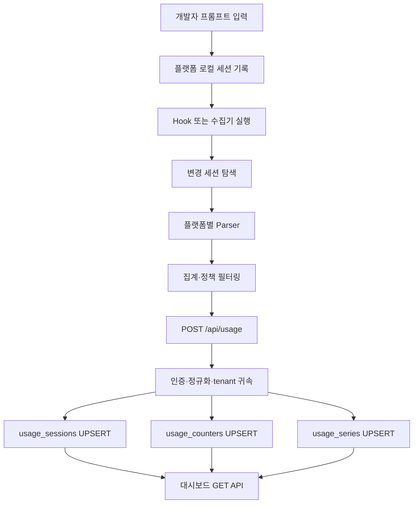

# 기획 — 프롬프트 입력 트랜잭션 흐름 및 수집 루프 검증

## 1. 목적

개발자가 Claude Code, Codex, Gemini CLI, Antigravity CLI에서 프롬프트를 입력한 순간부터
대시보드에 사용량이 표시될 때까지의 전체 처리 흐름을 추적 가능하게 만든다.

검증 대상:

- 어떤 로컬 원천 파일 또는 hook 이벤트가 생성되는가
- 수집기가 어떤 파일을 어떤 순서로 읽는가
- 어떤 값이 집계·제거·전송되는가
- 서버에서 어떤 테이블로 저장되는가
- 대시보드가 어떤 API를 조회하는가
- 재실행·재전송 시 중복 또는 누락이 발생하지 않는가

## 2. 현재 확정된 흐름



## 3. 구현 단계

### Phase 0 — 기준선 확보

- [ ] 작업 전 `git status --short` 기록
- [ ] 기존 테스트 실행
- [ ] 플랫폼별 CLI 버전 기록
- [ ] 각 원천 파일 경로와 hook 등록 상태 확인

```bash
go test ./collector/... -count=1
go test ./go/... -count=1
npm test -- --runInBand
```

완료 조건: 기존 실패와 새로 발생한 실패를 구분할 수 있다.

### Phase 1 — 트랜잭션 ID와 관측 지점 정의

각 단계에 공통 correlation 값을 부여한다. 기존 외부 payload 계약을 깨지 않는 범위에서
로컬 로그에만 기록한다.

```text
collection_run_id
source_platform
session_id
file_path_hash
event_time
stage
result
```

파일 원문, 프롬프트, tool args, API 토큰은 관측 로그에 기록하지 않는다.

관측 단계:

```text
source_discovered
source_changed
source_parsed
session_aggregated
payload_built
request_sent
request_accepted
checkpoint_saved
dashboard_read
```

완료 조건: 한 번의 수집 실행을 collection_run_id 하나로 재구성할 수 있다.

### Phase 2 — 수집 루프 검증

대상: `collector/cmd/usage-collector/main.go`

다음 반복 구조를 테스트한다.

```text
source
  → session group
    → changed session
      → source file
        → JSONL record
```

검증 케이스:

- [ ] 변경되지 않은 파일은 parser에 전달되지 않음
- [ ] `--all` 실행 시 전체 재처리
- [ ] 세션 재개로 파일이 여러 개인 경우 하나의 세션으로 합산
- [ ] 여러 플랫폼이 한 번에 처리될 때 `limit`이 플랫폼별로 적용됨
- [ ] 없는 원천 디렉터리는 오류 없이 건너뜀
- [ ] 비정상 JSONL 한 줄이 전체 세션을 손상시키지 않음
- [ ] 파일 파싱 실패 시 체크포인트에 기록하지 않고 재시도함

중요 점검:

현재 수집기에서 parser 오류가 발생해도 `pending` 파일에 추가될 가능성이 있으므로,
파싱 성공 파일만 checkpoint 대상이 되는지 별도 테스트한다.

### Phase 3 — 플랫폼별 원천 검증

| 플랫폼 | 입력 원천 | 실행 트리거 | 확인 항목 |
|---|---|---|---|
| Claude | `~/.claude/projects/**/*.jsonl` | SessionEnd hook | prompt 원문 제외, token·tool·LOC 집계 |
| Codex | `~/.codex/sessions/**/*.jsonl` | 증분 스캔 | token_count, cache field, tool event |
| Gemini | `~/.gemini/tmp/**/chats/*.jsonl` | 증분 스캔 | model·token·tool·MCP 집계 |
| Antigravity | statusLine spool | Stop hook | 상태값·세션·토큰·중복 flush |

각 플랫폼에서 동일한 테스트 프롬프트 세트를 사용한다.

```text
일반 질문 1회
파일 읽기 1회
셸 명령 1회
코드 수정 1회
도구 오류 1회
세션 종료 후 재실행
```

원문은 fixture에 저장하지 않고, 필드명·카운터·토큰 숫자만 익명화하여 보관한다.

### Phase 4 — 전송 및 서버 인테이크 검증

대상:

- `collector/internal/sender/`
- `go/internal/intake/`
- `go/internal/store/write.go`

검증 흐름:

```text
payload 생성
  → Bearer 인증
  → JSON decode
  → user/tenant 귀속
  → platform/runtime/model 정규화
  → 세션 저장
  → counter 저장
  → series 저장
  → 저장 건수 응답
```

검증 케이스:

- [ ] 인증 실패 시 저장되지 않음
- [ ] 같은 세션 재전송 시 값이 누적되지 않음
- [ ] 더 최신 절대값이 이전 값을 덮어씀
- [ ] 세션·카운터·series의 사용자 귀속이 갈라지지 않음
- [ ] 잘못된 platform/runtime은 안전한 기본값으로 정규화됨
- [ ] 빈 session ID는 저장되지 않음
- [ ] counter/series 일부 오류가 다른 행 저장을 막지 않음

### Phase 5 — 대시보드 반영 검증

대상: `web/lib/api.ts` 및 `/api/usage/*` 조회 API

검증 순서:

```text
POST 응답 확인
  → sessions 조회
  → summary 조회
  → series 조회
  → platforms 조회
  → coverage/dev 조회
  → 화면 숫자와 DB 숫자 대조
```

확인할 사항:

- [ ] 입력한 테스트 세션이 세션 목록에 표시됨
- [ ] 토큰 합계가 원천 집계와 일치함
- [ ] 도구/LOC 카운터가 개발 지표에 반영됨
- [ ] platform 필터가 모든 조회 API에 적용됨
- [ ] runtime 필터가 적용될 때 세션·series·counter 결과가 일치함
- [ ] 미수집 축이 0으로 오인되지 않음

## 4. 루프 안정성 검증

### 정상 루프

```text
새 로그 생성
  → hook/수동 실행
  → 변경 파일 선택
  → 집계
  → 전송
  → checkpoint 저장
```

### 재실행 루프

```text
같은 로그 재실행
  → 변경 없음
  → 전송 없음
  → DB 값 불변
```

### 전송 실패 루프

```text
집계 성공
  → 서버 전송 실패
  → checkpoint 미저장
  → 다음 실행에서 재전송
```

### 파싱 실패 루프

```text
파일 일부 파싱 실패
  → 실패 파일 checkpoint 미저장
  → 다음 실행에서 재시도
```

### 부분 기록 루프

```text
CLI가 JSONL 기록 중
  → collector가 파일 접근
  → 불완전한 마지막 줄 무시
  → 다음 실행에서 완성된 줄 재처리
```

## 5. 데이터 안전성 검증

자동 검사 항목:

- [ ] prompt 원문이 payload에 없음
- [ ] tool args 원문이 payload에 없음
- [ ] 파일 절대 경로가 payload에 없음
- [ ] API token이 로그·argv·payload에 없음
- [ ] 원본 파일 전체가 서버로 전송되지 않음
- [ ] correlation 로그에도 민감 데이터가 없음

## 6. 산출물

최종 작업 결과는 다음 파일 또는 결과로 남긴다.

- [ ] 플랫폼별 시퀀스/트랜잭션 흐름 문서
- [ ] 수집기 루프 단위 테스트
- [ ] 전송 실패·재시도 테스트
- [ ] 중복 전송 멱등성 테스트
- [ ] 개인정보 leak 검사 결과
- [ ] 플랫폼별 실제 fixture
- [ ] 미수집·수집됨·해당 없음 판정표
- [ ] 대시보드 숫자와 DB 대조 결과

## 7. 완료 기준

다음 조건을 모두 만족해야 완료로 판정한다.

1. 테스트 프롬프트 1건의 흐름을 `collection_run_id` 기준으로 추적할 수 있다.
2. 원천 집계값과 DB 저장값이 일치한다.
3. DB 저장값과 대시보드 표시값이 일치한다.
4. 동일 세션 재전송으로 값이 증가하지 않는다.
5. 네트워크 실패 후 재실행하면 데이터가 복구된다.
6. 파싱 실패 파일은 checkpoint에 기록되지 않는다.
7. 프롬프트·인자·경로·토큰이 서버로 전송되지 않는다.
8. 기존 4개 플랫폼의 회귀 테스트가 통과한다.

## 8. Claude 개발 세션용 실행 지시문

```text
docs/PLAN-transaction-flow.md를 기준으로 작업한다.

먼저 git status와 기존 테스트를 확인하고 기준선을 남긴다.
기존 사용자 변경을 되돌리거나 덮어쓰지 않는다.

Phase 0부터 순서대로 진행한다.
실제 원천 샘플 없이 parser 계약을 추정하지 않는다.
프롬프트 원문, tool args, 응답 원문, 파일 경로, 토큰은 저장하지 않는다.
파싱 실패 파일은 checkpoint에 기록하지 않도록 검증한다.
모든 변경에는 fixture와 회귀 테스트를 추가한다.
각 단계 종료 시 변경 파일, 테스트 결과, 확인된 데이터 흐름, 남은 위험을 보고한다.
```

